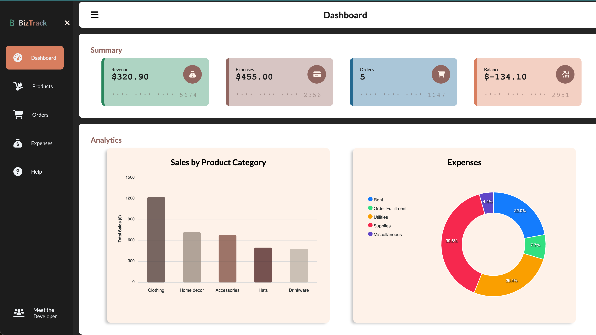

# 📋 BizTrack Project

BizTrack is a web app born from my experience running a small business. It’s a tool designed to simplify managing products, orders, and expenses seamlessly. As a small business owner, I created BizTrack to simplify the complexities of managing products, orders, and expenses. The inspiration for this project came from the challenges I faced in my own business. I wanted to develop a solution that could benefit “myself” and others in a similar situation.

## 📝 DEMO

Please refer to --- https://sumusa.github.io/biztrack/.

## 📷 Screenshots

## 📌 Features

- **Product Management**: Add, edit, or remove products with a user-friendly interface.
- **Order Tracking**: View order details and status and manage the entire order fulfillment process from processing to delivery.
- **Expenses Management**: Log expenses, categorize them and maintain a clear overview of all financial transactions.
- **Insightful Dashboard**: Gives a quick snapshot of the business with a dashboard that displays summary stats such as revenue, expenses, the number of orders, and current balance.
- **Search and Sort Entries**: Sort through the product, order and expense tables using the column headers.
- **Analytics**: Explore sales by product category and track expenses with visually appealing charts
- **Export to CSV**: Download all data tables into CSV seamlessly.

## 💪🏾 Motivation

Why this project? 😼 It all started with my eagerness to learn more about web development. This project marks the end of my first module in the Get Coding program, and boy, have I learned a lot!

From understanding how JavaScript functions work to making web pages interactive, it's been quite the journey. One of the coolest parts was learning how to visualize data using ApexCharts library, which made everything more interesting. Through experimenting with different techniques like loops and if statements, I've not only improved my coding skills but also learned how to make websites easier to use for everyone.

This project represents my growth, determination, and love for coding. I hope you enjoy checking it out as much as I enjoyed making it!

## 💻 Tech Stack Used

- HTML
- CSS
- JavaScript

## 🤝 Acknowledgments

A special thanks to my coach, [Sam](https://github.com/samwise-nl), for the invaluable guidance and support provided throughout the development of this project, and the [GetCoding NL](https://www.getcoding.ca/coaching-program-nl) software development program team for their continuous check-ins.
