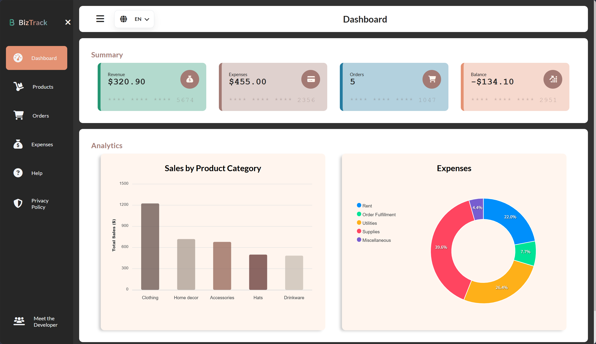

# 📋 BizTrack Project

BizTrack is a front-end order and business management application that was selected and enhanced as part of the CPT304 Software Engineering 2 coursework. Starting from the original open-source project, our team audited the codebase, identified concrete deficiencies, and implemented targeted improvements to accessibility, security, usability, internationalization, testing, and compliance. The current version is a research-led refinement of the original BizTrack app rather than a first-pass prototype.

## 📝 DEMO

Please refer to --- https://sumusa.github.io/biztrack/.

## 📷 Screenshots

## 📌 Features

- **Accessible CRUD Workflows**: Products, orders, and expenses can be added, edited, deleted, searched, and sorted through improved keyboard-accessible controls.
- **Localized Interface**: The application includes internationalization support with a working language switcher for multiple languages.
- **Dashboard and Analytics**: Business summary cards and charts present revenue, expenses, order volume, balance, category sales, and expense distribution.
- **Safer Rendering Logic**: Table rendering has been hardened to reduce unsafe DOM injection patterns and improve front-end security.
- **User Feedback and Status Messaging**: CRUD actions provide clearer success and error feedback to improve usability and reduce ambiguity.
- **CSV Export**: Core business datasets can be exported for reporting and backup purposes.
- **Privacy and Consent Support**: The app includes a privacy policy page and cookie/banner controls aligned with coursework baseline expectations.
- **Automated Test Coverage**: Core business modules are covered by automated tests with coverage reporting through Istanbul and Codecov.

## 💪🏾 Motivation

This repository documents the enhanced version of BizTrack developed for a research-led software improvement task. Our goal was not only to make the application work, but to raise it toward a more professional standard by auditing the original code, fixing meaningful deficiencies, and aligning the system with modern expectations around accessibility, maintainability, testing, and responsible deployment.

The project also reflects a practical software engineering process: deficiency detection, literature-informed refactoring, baseline compliance work, collaborative version control, and evidence-driven validation. In that sense, the repository captures both the improved product and the engineering work behind the improvement.

## 💻 Tech Stack Used

- HTML
- CSS
- JavaScript

## 🤝 Acknowledgments

A special thanks to my coach, [Sam](https://github.com/samwise-nl), for the invaluable guidance and support provided throughout the development of this project, and the [GetCoding NL](https://www.getcoding.ca/coaching-program-nl) software development program team for their continuous check-ins.

## Testing

- Install dependencies with `npm install`
- Run automated tests with `npm test`
- Generate an Istanbul coverage report with `npm run coverage`

Coverage output is generated in the `coverage/` folder and uploaded by GitHub Actions to Codecov.
